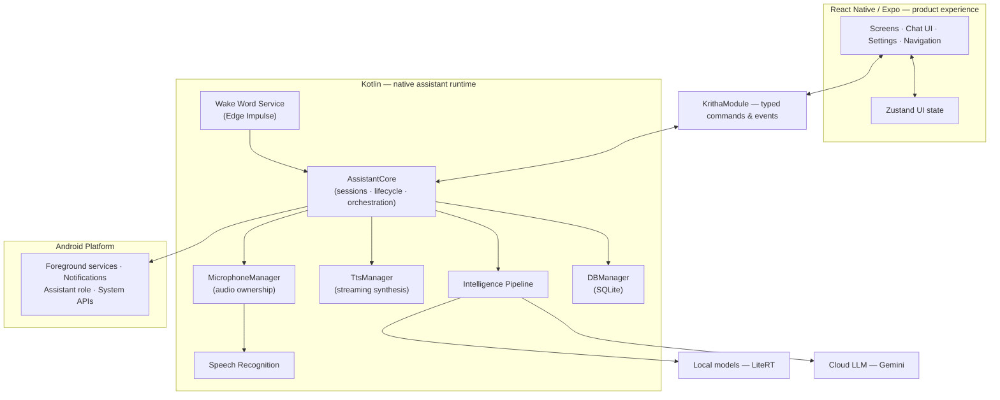
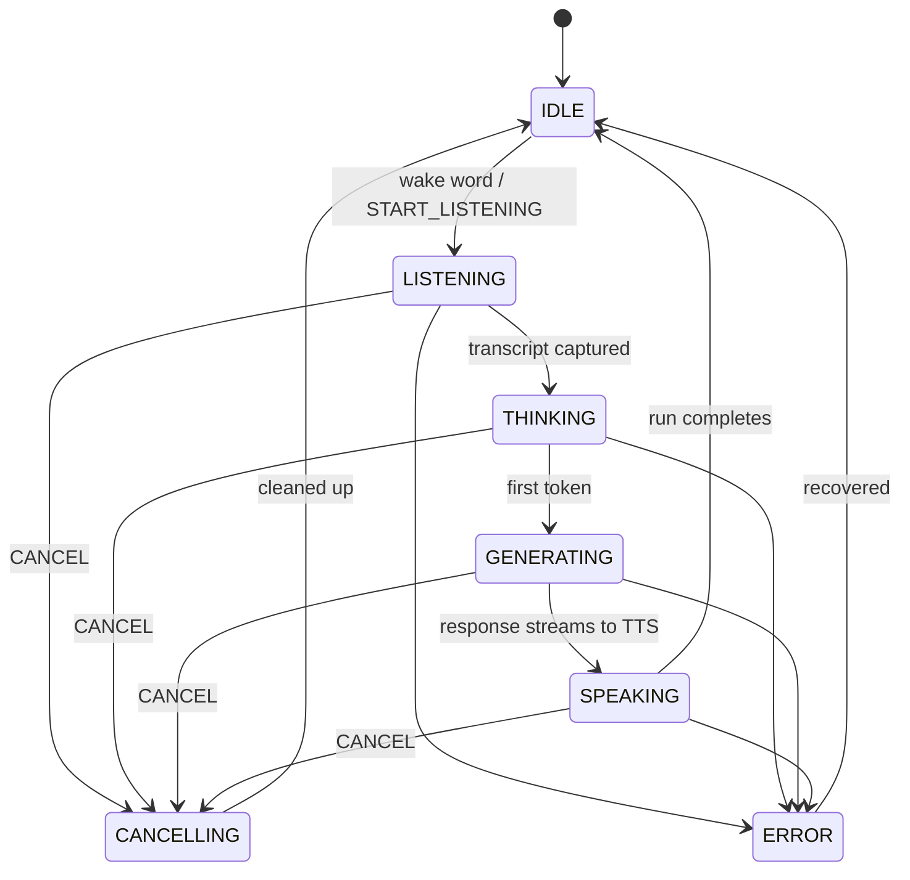
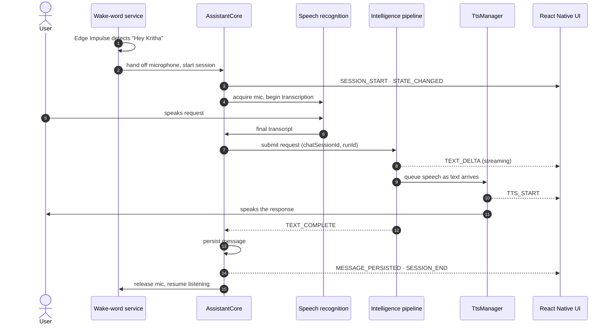
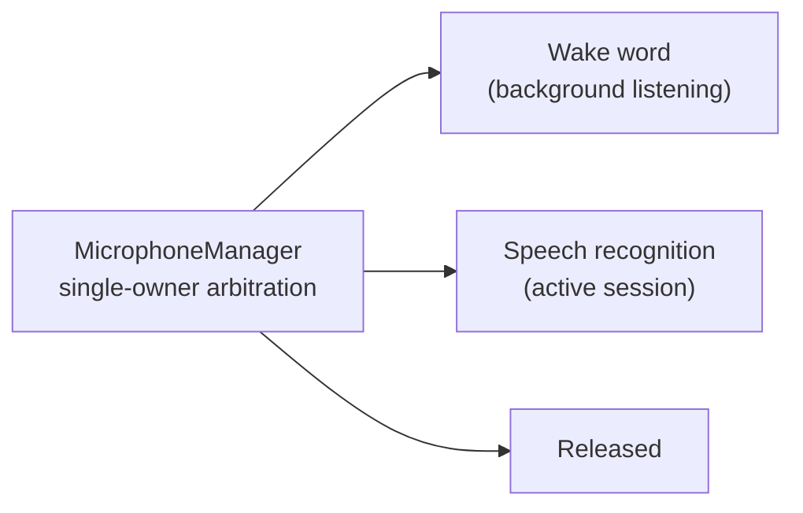
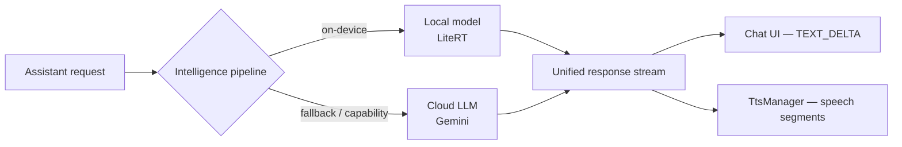

<div align="center">

  

# Kritha

**A voice-first, privacy-first AI assistant for Android.**

Native runtime · On-device intelligence · Cloud-ready

  <p>
    
    
    
    
    
    
    
  </p>

</div>

---

## ✨ Overview

Kritha is an Android AI assistant built around a **native assistant runtime** — not a React Native chat client with native bolted on.

The product UI is React Native + Expo. Everything that must stay reliable outside the React lifecycle — audio, wake-word detection, speech recognition, inference, TTS, persistence, and long-running sessions — is owned by a Kotlin runtime. The two communicate over a typed command/event bridge.

### Highlights

- 🎙️ **Always-on wake word** — “Hey Kritha,” detected by an Edge Impulse model inside an Android foreground service
- ⚡ **Streaming everything** — responses stream token-by-token into the chat _and_ the TTS queue
- 📴 **Local-first intelligence** — on-device inference via LiteRT, with cloud as fallback
- 🗣️ **Swappable voice models** — downloadable STT/TTS models (Zipformer, SenseVoice, Moonshine, Kokoro, Piper, Matcha, VITS)
- 💬 **Native chat persistence** — sessions live in native SQLite, independent of any React screen
- 🎛️ **Explicit microphone ownership** — wake word, dictation, and assistant audio never fight over the mic
- 🤖 **Deep Android integration** — assistant role, notification access, guided permissions onboarding

---

## 🧠 Architecture



The boundary is the point: React Native never touches assistant internals. It sends a command —

```ts
dispatchCommand({
  type: 'SUBMIT_TEXT',
  text,
  chatSessionId,
});
```

— and the native runtime owns execution, emitting structured events back.

| Native component      | Responsibility                        |
| --------------------- | ------------------------------------- |
| `AssistantCore`       | Assistant lifecycle & orchestration   |
| `MicrophoneManager`   | Explicit audio ownership              |
| `TtsManager`          | Streaming speech synthesis            |
| Wake-word service     | Always-on “Hey Kritha” (Edge Impulse) |
| Intelligence pipeline | Local (LiteRT) + cloud routing        |
| `DBManager`           | SQLite chat persistence               |

---

## ⚡ Assistant Runtime

One canonical state machine replaces scattered `isRecording` / `isSending` / `isSpeaking` flags:



### Commands

| Command           | Purpose                         |
| ----------------- | ------------------------------- |
| `SUBMIT_TEXT`     | Send a text request             |
| `START_LISTENING` | Begin voice input               |
| `STOP_LISTENING`  | Stop voice input                |
| `PLAY_TTS`        | Speak text                      |
| `PAUSE_TTS`       | Pause speech                    |
| `RESUME_TTS`      | Resume speech                   |
| `STOP_TTS`        | Stop speech                     |
| `CANCEL`          | Cancel the active assistant run |
| `DISMISS`         | Dismiss the assistant           |
| `OPEN_MAIN_APP`   | Open the main application       |

### Events

```text
SESSION_START · STATE_CHANGED · TEXT_DELTA · TEXT_COMPLETE · MESSAGE_PERSISTED
TTS_START · TTS_PAUSE · TTS_RESUME · TTS_STOP · TTS_COMPLETE · TTS_ERROR
SESSION_END · ERROR
```

Every operation carries `chatSessionId`, `assistantRunId`, `requestId`, and `messageId` — so streaming, cancellation, and TTS can safely overlap within a single run.

---

## 🎙️ A Voice Turn, End to End

The whole system in one diagram — from wake word to spoken response:



### Microphone ownership

The mic always has exactly one owner, arbitrated natively — so wake-word listening and dictation never collide:



### Streaming TTS

`TtsManager` speaks as text arrives — it never waits for the full response — with its own lifecycle, correlated to the active run and message:

```text
START → SPEAKING → PAUSE → RESUME → STOP / COMPLETE
```

---

## 🤖 Intelligence

One pipeline, two interchangeable backends:



- **Local** — models are downloaded and managed by the native runtime, executed on-device via LiteRT
- **Cloud** — Gemini, for when local inference is unavailable or insufficient

Both emit into the same response stream. The UI has no local/cloud special-casing.

---

## 💬 Conversations

Chat sessions are part of the native runtime — create, open, rename, pin, archive, delete, and persist messages all happen in Kotlin, independent of any React screen.

| Operation        | Native |
| ---------------- | :----: |
| Create chat      |   ✓    |
| Open chat        |   ✓    |
| Rename           |   ✓    |
| Pin              |   ✓    |
| Archive          |   ✓    |
| Delete           |   ✓    |
| Persist messages |   ✓    |

---

## 📱 Android Integration

Kritha operates as an Android assistant, not just a foreground chat app:

- Wake-word foreground service
- Native speech recognition & TTS
- Microphone ownership arbitration
- Assistant / default-assistant integration
- Notification listener integration
- Native model management (download, pause/resume, delete)
- Guided permissions onboarding

All of it is exposed through the controlled TypeScript API — never raw internals.

---

## 🛠️ Tech Stack

| Area               | Technology                                    |
| ------------------ | --------------------------------------------- |
| UI                 | React Native + Tamagui                        |
| Framework          | Expo (native dev builds)                      |
| Navigation         | Expo Router                                   |
| State              | Zustand                                       |
| Native runtime     | Kotlin                                        |
| Native bridge      | Expo Modules API                              |
| Local inference    | LiteRT                                        |
| Wake word          | Edge Impulse                                  |
| Speech recognition | Android Speech Recognition + on-device models |
| Text-to-speech     | Android TTS + on-device models                |
| Cloud LLM          | Gemini                                        |
| Persistence        | Native SQLite                                 |
| Package manager    | Bun                                           |

---

## 🗂️ Project Structure

```text
kritha/
├── android/                      # Native Android shell
├── modules/kritha/
│   ├── android/                  # Kotlin runtime
│   │   └── .../expo/modules/kritha/
│   │       ├── AssistantCore/
│   │       ├── DBManager/
│   │       ├── TtsManager/
│   │       ├── MicrophoneManager/
│   │       ├── intelligence/
│   │       ├── wakeword/
│   │       └── tools/
│   └── src/
│       └── KrithaModule.ts       # Typed public API
├── src/
│   ├── app/                      # Expo Router entry
│   ├── components/               # Chat UI, views, modals
│   ├── constants/                # Canonical states, model registry
│   ├── database/                 # Repositories, migrations, vector store
│   ├── hooks/                    # useSpeaker, useWakeword, useChatSession…
│   ├── services/                 # Runtime, chat, model, settings services
│   ├── stores/                   # Zustand stores
│   ├── theme/
│   └── types/
├── edge-impulse-exports/         # Wake-word model artifacts
└── assets/
```

---

## 🚀 Getting Started

### Requirements

- Node.js 18+
- Bun
- Android Studio + Android SDK
- Android emulator or physical device

### Install

```bash
git clone https://github.com/your-org/kritha.git
cd kritha
bun install
```

### Environment

```env
EXPO_PUBLIC_GEMINI_API_KEY=your_api_key_here
```

### Run

```bash
bun run start     # Metro / Expo dev server
bun run android   # native build + install
```

> **Note:** Kritha ships custom native Android code under `modules/kritha`, so **Expo Go is not supported** — use a development build.

---

## 🧩 Ownership Model

The goal is not “everything in Kotlin” or “everything in React Native.” It’s putting each responsibility **where it runs reliably**:

| Responsibility      | Owner                 |
| ------------------- | --------------------- |
| Rendering           | React Native          |
| UI state            | Zustand               |
| Assistant execution | `AssistantCore`       |
| Audio ownership     | `MicrophoneManager`   |
| Wake word           | Native service        |
| Speech recognition  | Native Android        |
| TTS                 | `TtsManager`          |
| Chat persistence    | Native DB             |
| Model execution     | Intelligence pipeline |
| Android integration | Kotlin                |

---

## 📄 License

MIT — see [`LICENSE`](LICENSE).
