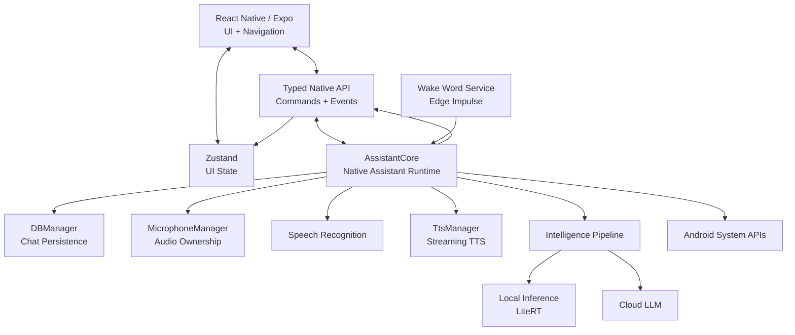
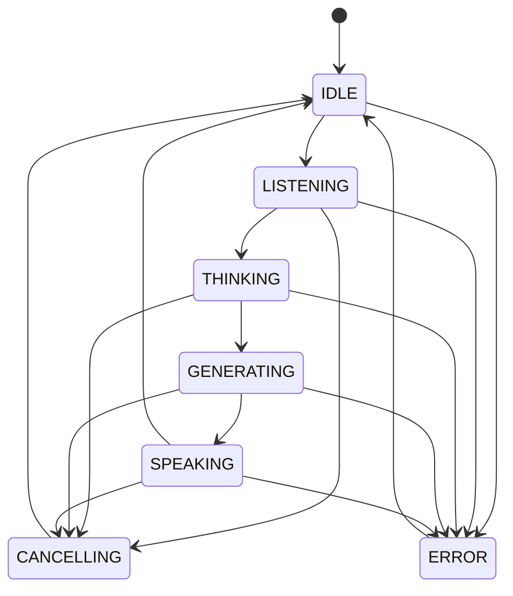
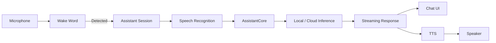
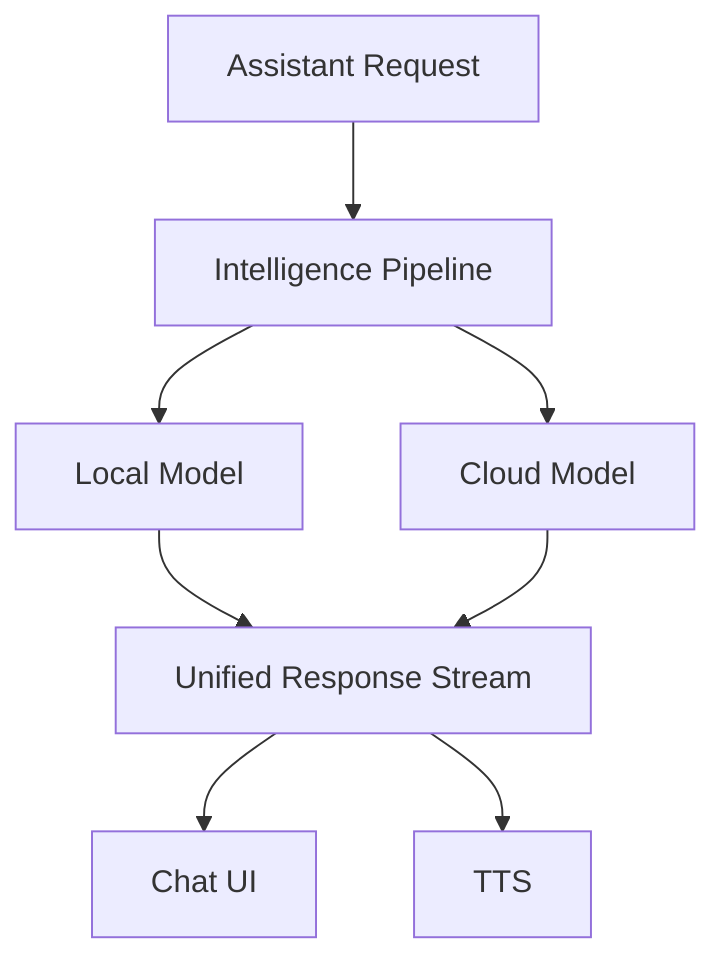
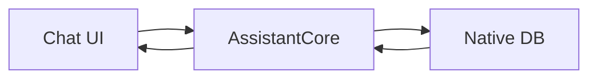

<div align="center">

  

  # Kritha

  **A native-powered, privacy-first AI assistant for Android.**

  Voice-first. Local-capable. Cloud-ready. Built for real-time interaction.

  <p>
    
    
    
    
    
  </p>

</div>

---

## ✨ What is Kritha?

Kritha is an Android AI assistant built around a **native assistant runtime** rather than treating the app as just a React Native chat client.

The UI is built with React Native + Expo, while the core assistant lifecycle is handled natively through Kotlin. This gives Kritha direct control over things that need to remain reliable outside the React lifecycle: **audio, wake-word detection, speech recognition, inference, TTS, persistence, Android integration, and long-running assistant sessions.**

The result is a hybrid system where React Native handles the product experience and Kotlin handles the assistant itself.

---

## 🧠 Architecture



### The important boundary

```text
┌─────────────────────────────────────────────┐
│              React Native / Expo            │
│                                             │
│  Screens • Chat UI • Settings • Navigation  │
│              • Zustand Store                │
└──────────────────────┬──────────────────────┘
                       │
              Typed Commands / Events
                       │
┌──────────────────────▼──────────────────────┐
│              Kotlin Runtime                 │
│                                             │
│  AssistantCore • Sessions • Audio • TTS     │
│  Wake Word • STT • Models • Persistence     │
└──────────────────────┬──────────────────────┘
                       │
┌──────────────────────▼──────────────────────┐
│              Android Platform               │
│                                             │
│  Microphone • TTS • Foreground Service      │
│  Notifications • Assistant • System APIs    │
└─────────────────────────────────────────────┘
```

React Native does **not** need to know how an assistant request is executed internally.

It sends a command:

```ts
dispatchCommand({
  type: 'SUBMIT_TEXT',
  text,
  chatSessionId,
});
```

The native runtime owns the execution and sends structured events back.

---

## ⚡ Assistant Runtime

Kritha uses a single canonical assistant lifecycle:



This replaces the old approach of having independent flags for recording, sending, generating and speaking.

### Commands

| Command           | Purpose                         |
| ----------------- | ------------------------------- |
| `SUBMIT_TEXT`     | Send a text request             |
| `START_LISTENING` | Begin voice input               |
| `STOP_LISTENING`  | Stop voice input                |
| `PLAY_TTS`        | Speak text                      |
| `PAUSE_TTS`       | Pause speech                    |
| `RESUME_TTS`      | Resume speech                   |
| `STOP_TTS`        | Stop speech                     |
| `CANCEL`          | Cancel the active assistant run |
| `DISMISS`         | Dismiss the assistant           |
| `OPEN_MAIN_APP`   | Open the main application       |

### Events

The runtime emits typed events such as:

```text
SESSION_START
STATE_CHANGED
TEXT_DELTA
TEXT_COMPLETE
MESSAGE_PERSISTED

TTS_START
TTS_PAUSE
TTS_RESUME
TTS_STOP
TTS_COMPLETE
TTS_ERROR

SESSION_END
ERROR
```

Every assistant operation can be correlated using:

```text
chatSessionId
assistantRunId
requestId
messageId
```

That becomes especially important when **streaming, cancellation and TTS happen concurrently**.

---

## 🎙️ Voice Pipeline



### Wake Word

The wake-word system runs independently through an Android foreground service using the Edge Impulse audio pipeline.

```text
Always-on listener
       ↓
Audio capture
       ↓
Edge Impulse inference
       ↓
"Hey Kritha"
       ↓
AssistantCore
```

The wake-word service is therefore not dependent on whether the React screen is currently mounted.

### Microphone ownership

Kritha explicitly tracks who owns the microphone:

```text
          ┌─────────────┐
          │ Microphone  │
          └──────┬──────┘
                 │
       ┌─────────┼─────────┐
       ▼         ▼         ▼
     STT     WAKE_WORD    NONE
```

This prevents wake-word detection and speech recognition from fighting over the same audio input.

---

## 🔊 Streaming TTS

TTS is handled by the native `TtsManager`.

Instead of waiting for an entire response:

```text
LLM response
     │
     ├── "Hey, Kaushal."
     ├── "Here's what I found..."
     ├── "The important part is..."
     │
     ▼
TTS queue
     │
     ▼
Speaker
```

TTS maintains its own lifecycle and correlates speech with the active assistant run and message.

Supported lifecycle:

```text
START → SPEAKING → PAUSE → RESUME → STOP / COMPLETE
```

---

## 🤖 Intelligence

Kritha supports both local and cloud inference.



### Local

Local models are managed directly by the native runtime and can be downloaded and controlled from the application.

```text
Available Models
      ↓
Download
      ↓
Pause / Resume
      ↓
Local Storage
      ↓
LiteRT
      ↓
On-device inference
```

### Cloud

Cloud models provide an escape hatch when local inference is unavailable or insufficient.

The important part is that **the UI does not need a different architecture for local and cloud responses**. Both feed into the same assistant runtime and event stream.

---

## 💬 Conversations

Chat sessions are now part of the native assistant runtime.

Supported operations include:

| Operation        | Native |
| ---------------- | :----: |
| Create chat      |    ✓   |
| Open chat        |    ✓   |
| Rename           |    ✓   |
| Pin              |    ✓   |
| Archive          |    ✓   |
| Delete           |    ✓   |
| Persist messages |    ✓   |

This means chat lifecycle is not tied to a React component or screen.



---

## 📱 Android Integration

Kritha is designed to operate as an Android assistant, not simply as a foreground chat application.

Current native integration includes:

* Wake-word foreground service
* Native speech recognition
* Native TTS
* Microphone ownership
* Assistant/default-assistant integration
* Notification listener integration
* Android system APIs
* Native model management

The native module exposes these capabilities through a controlled TypeScript API rather than exposing the internal implementation directly.

---

## 🗂️ Project Structure

```text
kritha/
│
├── android/
│
├── assets/
│
├── edge-impulse-exports/
│
├── modules/
│   └── kritha/
│       ├── android/
│       │   └── src/main/java/
│       │       └── expo/modules/kritha/
│       │           ├── AssistantCore
│       │           ├── DBManager
│       │           ├── TtsManager
│       │           ├── MicrophoneManager
│       │           ├── intelligence/
│       │           ├── wakeword/
│       │           └── tools/
│       │
│       └── src/
│           ├── KrithaModule.ts
│           └── index.ts
│
├── src/
│   ├── app/
│   ├── components/
│   ├── hooks/
│   ├── services/
│   ├── store/
│   └── theme/
│
├── app.json
├── package.json
└── tamagui.config.ts
```

---

## 🛠️ Tech Stack

| Area            | Technology                 |
| --------------- | -------------------------- |
| UI              | React Native               |
| Framework       | Expo                       |
| Navigation      | Expo Router                |
| State           | Zustand                    |
| Native Runtime  | Kotlin                     |
| Native Bridge   | Expo Modules API           |
| Local ML        | LiteRT                     |
| Wake Word       | Edge Impulse               |
| STT             | Android Speech Recognition |
| TTS             | Android TextToSpeech       |
| Persistence     | Native SQLite              |
| Package Manager | Bun                        |
| Platform        | Android                    |

---

## 🚀 Getting Started

### Requirements

* Node.js 18+
* Bun
* Android Studio
* Android SDK
* Android emulator or physical Android device

### Install

```bash
git clone https://github.com/your-org/kritha.git
cd kritha

bun install
```

### Environment

```env
EXPO_PUBLIC_GEMINI_API_KEY=your_api_key_here
```

### Development

Start Metro / Expo:

```bash
bun run start
```

Build the native Android application:

```bash
bun run android
```

> **Note:** Kritha uses custom native Android code under `modules/kritha`, so **Expo Go is not supported**. Use a native development build.

---

## 🧩 Development Philosophy

Kritha follows a simple ownership model:

| Responsibility      | Owner                    |
| ------------------- | ------------------------ |
| Rendering           | React Native             |
| UI state            | Zustand                  |
| Assistant execution | `AssistantCore`          |
| Audio ownership     | `MicrophoneManager`      |
| Wake word           | Native wake-word service |
| Speech recognition  | Native Android           |
| TTS                 | `TtsManager`             |
| Chat persistence    | Native DB                |
| Model execution     | Intelligence pipeline    |
| Android integration | Kotlin                   |

The goal is not to put everything into Kotlin or everything into React Native.

The goal is to put each responsibility **where it can be executed reliably**.

---

## 📄 License

MIT License. See [`LICENSE`](LICENSE).